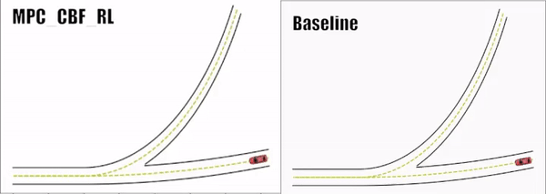

# Reinforcement Learning-based Adaptive Control Barrier Functions using Receding Horizon Control for Safety-Critical Systems
[](https://opensource.org/licenses/MIT)

The repository contains the simulation code for the paper "Reinforcement Learning-based Adaptive Control Barrier Functions using Receding Horizon Control for Safety-Critical Systems" submitted at CDC 2024.

## Table of Contents
- [Compatibility](#compatibility)
- [Installation](#installation)
- [Contributing](#contributing)
- [License](#license)
- [Contributers](#contributors)

## Compatibility
This code has been tested on ubuntu 20.04. Although there should be no difficulty with running it on windows 10+ 
## Installation

Please setup the conda environment by running the following command.

```
conda env create -n envName -f environment.yml
```
Then download/clone the repository.

## Results
This is the video of the simulation results presented in the paper as a concept of proof for feasiblity improvement.
<p align="center">
  
</p>


To generate the numerical results shown in the table I for the proposed approach, please run the following command.

```
python train_RL_env_MPC_AV.py method=RL_MPC_CBF

```

To generate the results for the baseline case you need specify modes with which you can run the experiments, conservative, moderately conservative, moderately aggressive, aggressive denoted by 'c', mc,'ma','a' in the code.
For example in order to run the baseline-conservative, the following command has to be run:
```
python train_RL_env_MPC_AV.py method=baseline type=c
```

Please note that all the runs can be with or without visualization (the default is with Visualization). To disable visualization the following command can be run: 
```
python train_RL_env_MPC_AV.py render_mode=None
```
## License

This project is licensed under the MIT License - see the [LICENSE](LICENSE) file for details.

### Contributors

Thanks to the following people who have contributed to this project:

- [Sabbir H M Ahmad](https://github.com/SabbirAhmad26)
- [Vittorio Giammarino](https://github.com/VittorioGiammarino)
